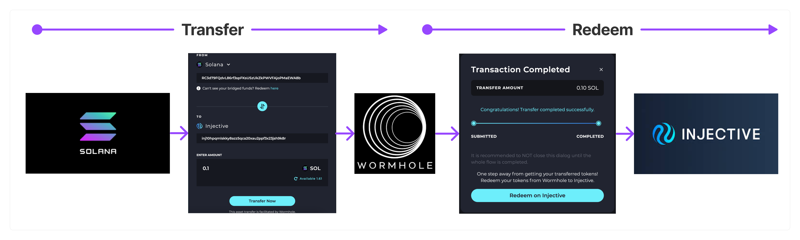

# Wormhole - Enigma Bridge

In this section, you will learn the details of how the Enigma Wormhole bridge works in addition to the most frequently asked questions

Enigma Wormhole Bridge allows you to bridge tokens across different chains. Instead of swapping or converting assets directly, Wormhole locks your source assets in a [smart contract](https://hub.enigma.network/proposal/184) and mints new Wormhole-wrapped assets on Enigma.

If you are interested in the technical details of this integration, check on the [Enigma adapter contract](https://github.com/EnigmasLab/cw20-adapter), which can be used to transform CW20 tokens into [new bank denom tokens](https://docs.enigma.network/develop/modules/Enigma/tokenfactory/).

:::info
All different source chains have the same steps to bridge, *Transfer and Redeem*, yet the experience can be different based on the time to confirm transactions on the source chain.

*Ethereum to Enigma* will be slower than *Solana to Enigma* and will show a different UX to guide you through the process.
:::

## Where can I see my transactions?

All your **Completed**, **In progress** and **Failed or Canceled** transactions are in the History section, at the bottom of the [bridge page](https://hub.enigma.network/bridge).
