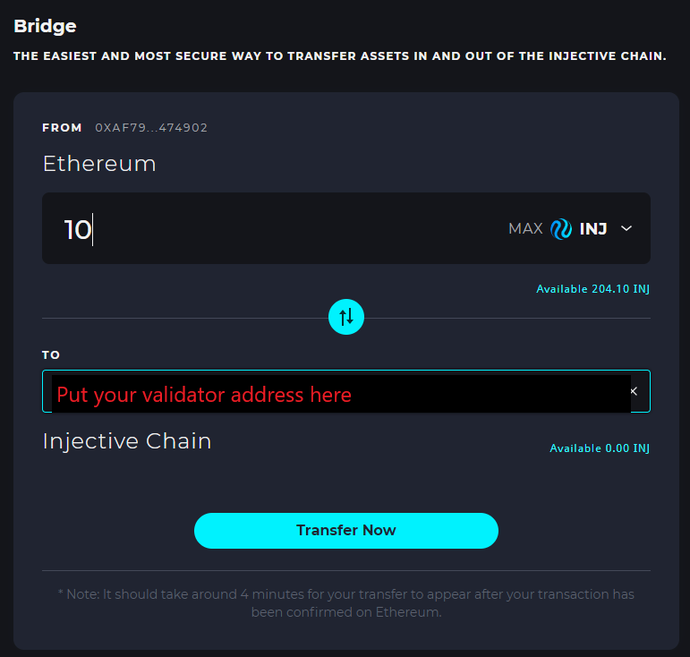

# Becoming a Validator

### Hardware Requirements

| *Minimum* | *Recommendation* | 
| :---: | :---: |
| RAM Memory  64GB  | RAM Memory 128GB |
| CPU 8 cores  | CPU 12 cores  |
| Storage 1TB  | Storage 2TB  |
| Network 1Gbps+  | Network 5Gbps+  |

### Step 1: Create a Validator Account

First, run the keygen command with your desired validator key name.   

```bash
export VALIDATOR_KEY_NAME=[my-validator-key]
enigmad keys add $VALIDATOR_KEY_NAME
```

This will derive a new private key and encrypt it to disk. Make sure to remember the password you used.

```bash
# EXAMPLE OUTPUT
- name: myvalidatorkey
  type: local
  address: fury1queq795wx8gzqc8706uz80whp07mcgg5nmpj6h
  pubkey: furypub1r0mckeepqwzmrzt5af00hgc7fhve05rr0q3q6wvx4xn6k46zguzykdszg6cnu0zca4q
  mnemonic: ""
  threshold: 0
  pubkeys: []


**Important** write this mnemonic phrase in a safe place.
It is the only way to recover your account if you ever forget your password.
```

**⚠️ important ⚠️  
The output will contain a mnemonic phrase that represents your key in plain text. Make sure to save this phrase as a backup of your key, since without a key you will not be able to control your validator. The phrase is better be backed up on physical paper, storing it in cloud storage may compromise your validator later.**

Remember the address starting from `fury`, this is going to be your Enigma Chain Validator Account address.

### Step 2: Obtain Mainnet FURY

To proceed with the next step, you will need to obtain some real FURY on Mainnet Ethereum (ERC-20 token address [`0xe28b3b32b6c345a34ff64674606124dd5aceca30`](https://etherscan.io/token/0xe28b3b32b6c345a34ff64674606124dd5aceca30)).

### Step 3: "Transfer" FURY to your validator account on the Enigma Chain

Deposit your Mainnet FURY tokens into your validator's account on the Enigma Chain by using the staking dashboard. You will have to [connect your wallet](https://medium.com/enigma-labs/enigma-hub-guide-9a14f09f6a7d)on our [Hub](https://hub.enigma.network/bridge) and then deposit FURY from Ethereum Mainnet network. This will trigger an automated bridge that maps tokens from Ethereum network to the Enigma Chain.



After a few minutes, you should be able to verify that your deposit was successful on the UI. Alternatively, you can query your account balance using the `enigmad` CLI with the following command:

```bash
enigmad q bank balances <my-validator-fury-address>
```

### Step 4: Create your validator account

Obtain your node's tendermint validator Bech32 encoded PubKey consensus address.

```bash
VALIDATOR_PUBKEY=$(enigmad tendermint show-validator)
echo $VALIDATOR_PUBKEY

# Example: {"@type": "/cosmos.crypto.ed25519.PubKey", "key": "GWEJv/KSFhUUcKBWuf9TTT3Ful+3xV/1lFhchyW1TZ8="}
```

Then create your new validator initialized with a self-delegation with your FURY tokens. Most critically, you will need to decide on the values of your validator's staking parameters.

* `--moniker` - Your validator's name
* `--amount` -  Your validator's initial amount of FURY to bond
* `--commission-max-change-rate` - Your validator's maximum commission change rate percentage (per day)
* `--commission-max-rate` - Your validator's maximum commission rate percentage
* `--commission-rate` - Your validator's initial commission rate percentage
* `--min-self-delegation` - Your validator's minimum required self delegation

Once you decide on your desired values, set them as follows.
```bash
MONIKER=<my-moniker>
AMOUNT=100000000000000000000fury # to delegate 100 FURY, as FURY is represented with 18 decimals.  
COMMISSION_MAX_CHANGE_RATE=0.1 # e.g. for a 10% maximum change rate percentage per day
COMMISSION_MAX_RATE=0.1 # e.g. for a 10% maximum commission rate percentage
COMMISSION_RATE=0.1 # e.g. for a 10% initial commission rate percentage
MIN_SELF_DELEGATION_AMOUNT=50000000000000000000 # e.g. for a minimum 50 FURY self delegation required on the validator
```

Then run the following command to create your validator.

```bash
enigmad tx staking create-validator \
--moniker=$MONIKER \
--amount=$AMOUNT \
--gas-prices=500000000fury \
--pubkey=$VALIDATOR_PUBKEY \
--from=$VALIDATOR_KEY_NAME \
--keyring-backend=file \
--yes \
--node=tcp://localhost:26657 \
--chain-id=enigma-1
--commission-max-change-rate=$COMMISSION_MAX_CHANGE_RATE \
--commission-max-rate=$COMMISSION_MAX_RATE \
--commission-rate=$COMMISSION_RATE \
--min-self-delegation=$MIN_SELF_DELEGATION_AMOUNT
```

Extra `create-validator` options to consider:

```
--identity=        		The optional identity signature (ex. UPort or Keybase)
--pubkey=          		The Bech32 encoded PubKey of the validator
--security-contact=		The validator's (optional) security contact email
--website=         		The validator's (optional) website
```

You can check that your validator was successfully created by checking the [staking dashboard](https://staking.enigma.network/validators) or by entering the following CLI command.

```bash
enigmad q staking validators
```

If you see your validator in the list of validators, then congratulations, you've officially joined as an Enigma Mainnet validator! 🎉


### Step 5: (Optional) Delegate Additional FURY to your Validator

To gain a deeper empirical understanding of user experience that your future delegators will experience, you can try delegation through [Staking Guide](https://medium.com/enigma-labs/enigma-hub-guide-9a14f09f6a7d).

These steps will allow you to experience the delegation flow using MetaMask Transactions. 🦊

Alternatively, you can always use the Enigma CLI to send a delegation transaction.  

```bash
enigmad tx staking delegate [validator-addr] [amount] --from $VALIDATOR_KEY_NAME --keyring-backend=file --yes --node=tcp://localhost:26657
```

### Next Steps

Next, proceed to setup your Ethereum Bridge Relayer. This is a necessary step in order to prevent your validator from being slashed. You should do this immediately after setting up your validator.
